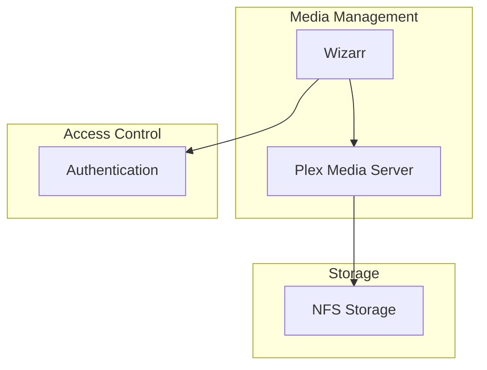
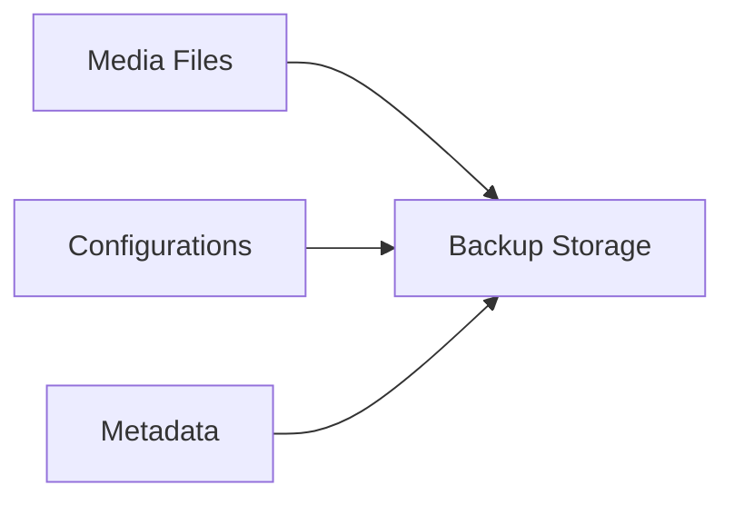

# Media Applications

## Media Stack Overview



## Components

### Media Server
- **Plex Media Server**
  - Media streaming service
  - Transcoding capabilities
  - Library management
  - Multi-user support

### User Management
- **Wizarr**
  - User invitation system
  - Plex account management
  - Access control
  - Integration with authentication

## Storage Configuration

### Media Storage
```yaml
apiVersion: v1
kind: PersistentVolumeClaim
metadata:
  name: media-storage
spec:
  accessModes:
    - ReadWriteMany
  storageClassName: nfs-csi
  resources:
    requests:
      storage: 1Ti
```

## Network Configuration

### Service Configuration
- Internal service discovery
- External access through ingress
- Secure connections with TLS

### Example Ingress
```yaml
apiVersion: networking.k8s.io/v1
kind: Ingress
metadata:
  name: media-ingress
  annotations:
    cert-manager.io/cluster-issuer: letsencrypt-prod
spec:
  rules:
    - host: plex.example.com
      http:
        paths:
          - path: /
            pathType: Prefix
            backend:
              service:
                name: plex
                port:
                  number: 32400
```

## Resource Management

### Resource Allocation
- CPU and memory limits
- Storage quotas
- Network bandwidth considerations

### Example Resource Configuration
```yaml
resources:
  limits:
    cpu: "4"
    memory: 8Gi
  requests:
    cpu: "2"
    memory: 4Gi
```

## Maintenance

### Backup Strategy


### Regular Tasks
1. Database backups
2. Configuration backups
3. Media library scans
4. Storage cleanup

## Monitoring

### Key Metrics
- Server health
- Transcoding performance
- Storage usage
- Network bandwidth
- User activity

### Alerts
- Storage capacity warnings
- Service availability
- Performance degradation
- Failed transcoding jobs

## Troubleshooting

Common issues and resolution steps:
1. **Streaming Issues**
   - Check network connectivity
   - Verify transcoding settings
   - Monitor resource usage
   - Review logs

2. **Storage Problems**
   - Verify mount points
   - Check permissions
   - Monitor disk space
   - Review I/O performance

3. **User Access Issues**
   - Verify authentication
   - Check authorization
   - Review user permissions
   - Check invitation system
