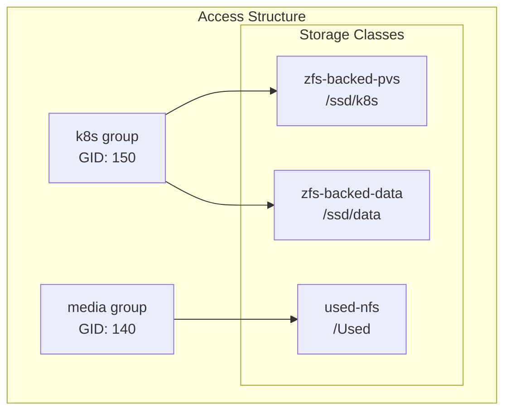

# NAS Storage Permissions

## Group Configuration



## Export Configuration

### ZFS Dataset Permissions (circe.manor)

1. **/ssd/k8s**
```bash
# Set ownership and permissions
chown kube:media /ssd/k8s
chmod 770 /ssd/k8s

# Set default ACLs
setfacl -d -m g:media:rwx /ssd/k8s
```

2. **/ssd/data**
```bash
# Set ownership and permissions
chown kube:media /ssd/data
chmod 770 /ssd/data

# Set default ACLs
setfacl -d -m g:media:rwx /ssd/data
```

### Legacy Storage Permissions (openmediavault-used)

1. **/Used**
```bash
# Set ownership and permissions
chown kube:media /Used
chmod 770 /Used

# Set default ACLs
setfacl -d -m g:media:rwx /Used
```

### NFS Export Configuration

For circe.manor (/etc/exports):
```bash
/ssd/k8s    *(rw,sync,no_subtree_check,no_root_squash,all_squash,anonuid=1000,anongid=150)
/ssd/data   *(rw,sync,no_subtree_check,no_root_squash,all_squash,anonuid=1000,anongid=150)
```

For openmediavault-used (/etc/exports):
```bash
/Used       *(rw,sync,no_subtree_check,no_root_squash,all_squash,anonuid=1000,anongid=140)
```

#### Export Options Explained
- `rw`: Read-write access
- `sync`: Synchronous writes for data integrity
- `no_subtree_check`: Improves reliability
- `no_root_squash`: Allow root access for system operations
- `all_squash`: Map all users to anonymous user
- `anonuid=0`: Map anonymous user to root
- `anongid=140`: Map anonymous group to media group (GID 140)

## Kubernetes Integration

### Existing Storage Classes

1. **zfs-backed-pvs** (Primary K8s Storage)
```yaml
apiVersion: storage.k8s.io/v1
kind: StorageClass
metadata:
  name: zfs-backed-pvs
provisioner: nfs.csi.k8s.io
parameters:
  server: circe.manor
  share: /ssd
  subdir: k8s
mountOptions:
  - nfsvers=4.1
  - nconnect=8
  - hard
  - noatime
  - nodiratime
```

2. **zfs-backed-data** (General Data Storage)
```yaml
apiVersion: storage.k8s.io/v1
kind: StorageClass
metadata:
  name: zfs-backed-data
provisioner: nfs.csi.k8s.io
parameters:
  server: circe.manor
  share: /ssd
  subdir: data
mountOptions:
  - nfsvers=4.1
  - nconnect=8
  - hard
  - noatime
  - nodiratime
```

3. **used-nfs** (Legacy Storage)
```yaml
apiVersion: storage.k8s.io/v1
kind: StorageClass
metadata:
  name: used-nfs
provisioner: nfs.csi.k8s.io
parameters:
  server: openmediavault-used.manor
  share: /Used
mountOptions:
  - nfsvers=4.1
  - nconnect=8
  - hard
  - noatime
  - nodiratime
```

## Security Considerations

1. **File System Permissions**
   - Consistent GID 140 (media group) across all storage
   - Default ACLs for new file/directory creation
   - Regular permission audits
   - Maintain root:media ownership

2. **NFS Security**
   - NFSv4.1 with multiple connections (nconnect=8)
   - Performance optimizations (noatime, nodiratime)
   - Hard mounts for reliability
   - Consistent export options across servers

3. **Kubernetes Security**
   - Storage class-specific access controls
   - Volume expansion enabled
   - Retain reclaim policy
   - Immediate volume binding

## Best Practices

1. **Permission Management**
   - Always use media group (GID 140) for access control
   - Maintain consistent ownership across all exports
   - Document any permission changes
   - Regular permission verification

2. **Access Control**
   - Use appropriate storage class based on workload
   - Monitor volume usage and expansion
   - Regular access audits
   - Document access patterns

3. **Monitoring**
   - Track storage utilization
   - Monitor NFS performance
   - Alert on permission changes
   - Regular mount point checks
