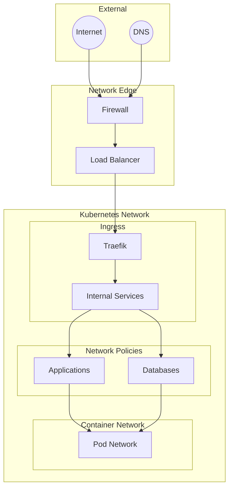
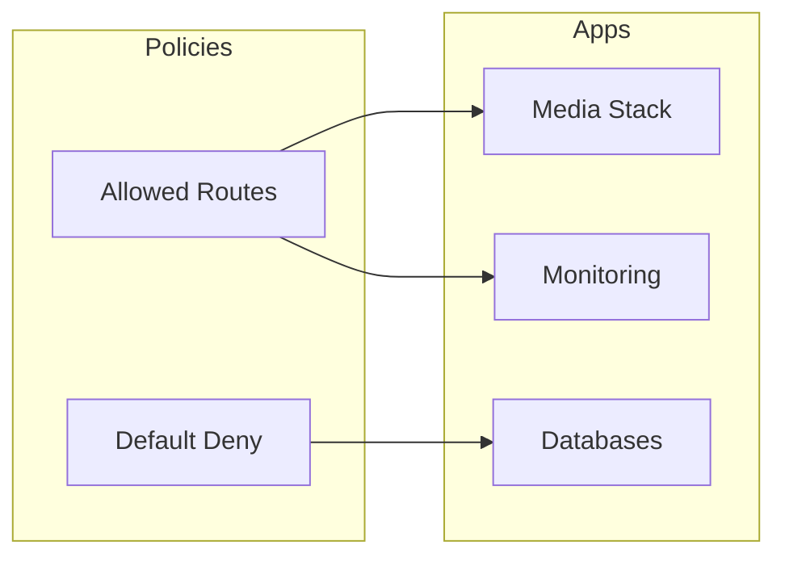
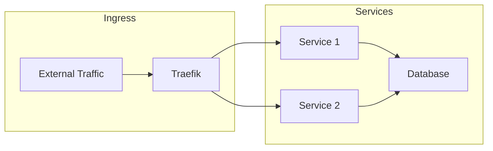

# Network Architecture

## Network Overview



## Components

### Ingress Controller
- **Traefik**: Main ingress controller
  - SSL/TLS termination
  - Automatic certificate management
  - Route configuration
  - Load balancing

### Network Policies


### DNS Configuration
- External DNS for automatic DNS management
- Internal DNS resolution
- Split DNS configuration

## Security

### Network Policies
```yaml
apiVersion: networking.k8s.io/v1
kind: NetworkPolicy
metadata:
  name: default-deny
spec:
  podSelector: {}
  policyTypes:
  - Ingress
  - Egress
```

### TLS Configuration
- Automatic certificate management via cert-manager
- Let's Encrypt integration
- Internal PKI for service mesh

## Service Mesh

### Traffic Flow


## Best Practices

1. **Security**
   - Implement default deny policies
   - Use TLS everywhere
   - Regular security audits
   - Network segmentation

2. **Performance**
   - Load balancer optimization
   - Connection pooling
   - Proper resource allocation
   - Traffic monitoring

3. **Reliability**
   - High availability configuration
   - Failover planning
   - Backup routes
   - Health checks

4. **Monitoring**
   - Network metrics collection
   - Traffic analysis
   - Latency monitoring
   - Bandwidth usage tracking

## Troubleshooting

Common network issues and resolution steps:
1. **Connectivity Issues**
   - Check network policies
   - Verify DNS resolution
   - Inspect service endpoints
   - Review ingress configuration

2. **Performance Problems**
   - Monitor network metrics
   - Check for bottlenecks
   - Analyze traffic patterns
   - Review resource allocation
