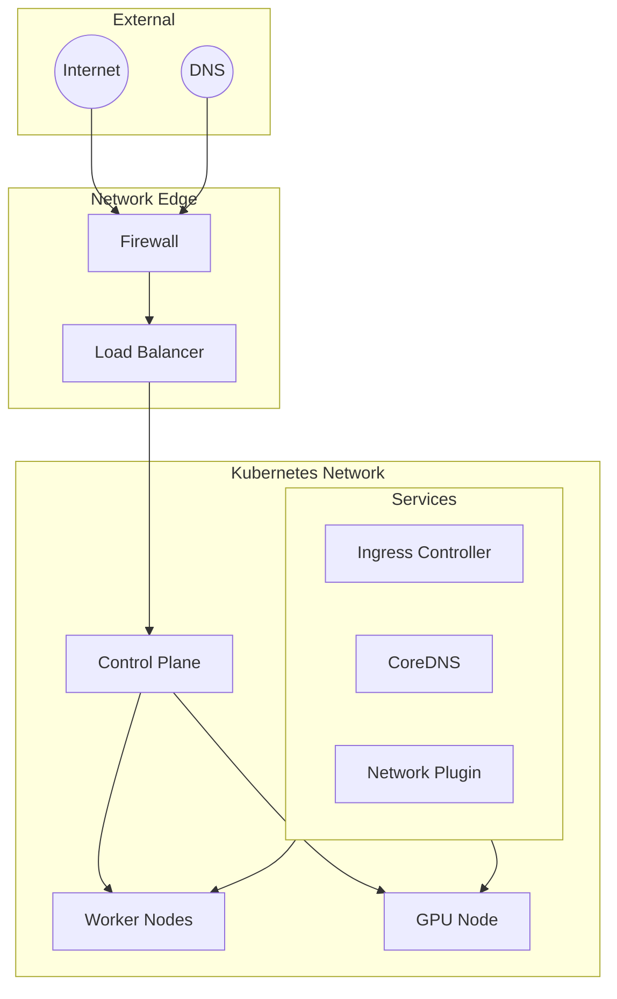
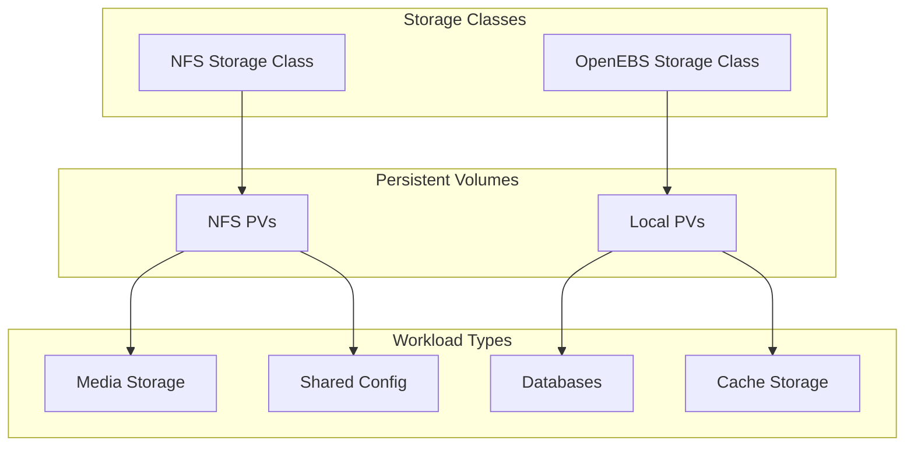
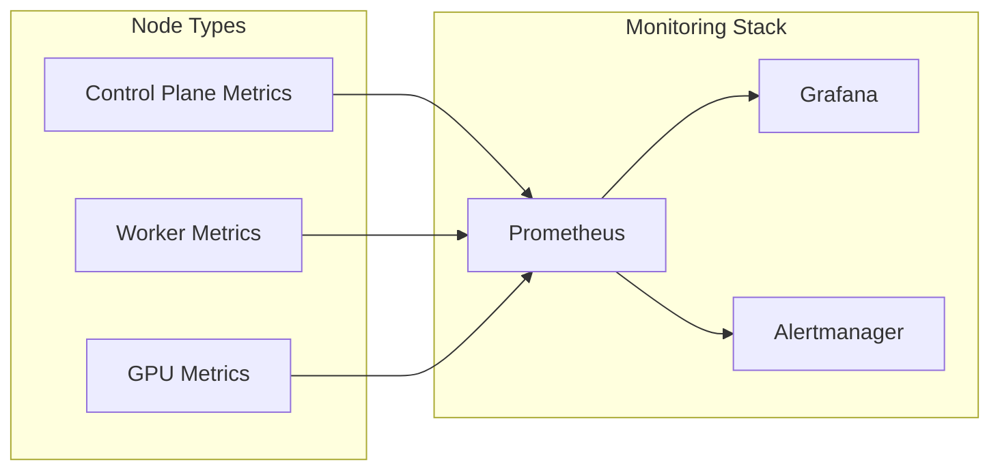

# Architecture Overview

## Cluster Architecture

```mermaid
graph TD
    subgraph Control Plane
        CP1[Control Plane 1<br>4 CPU, 16GB]
        CP2[Control Plane 2<br>4 CPU, 16GB]
        CP3[Control Plane 3<br>4 CPU, 16GB]

        CP1 --- CP2
        CP2 --- CP3
        CP3 --- CP1
    end

    subgraph Worker Nodes
        W1[Worker 1<br>16 CPU, 128GB]
        W2[Worker 2<br>16 CPU, 128GB]
    end

    subgraph GPU Node
        GPU[GPU Worker<br>16 CPU, 128GB<br>4x Tesla P100]
    end

    Control Plane --> Worker Nodes
    Control Plane --> GPU
```

## Core Components

### Control Plane
- **High Availability**: 3-node control plane configuration
- **Resource Allocation**: 4 CPU, 16GB RAM per node
- **Components**:
  - etcd cluster
  - API Server
  - Controller Manager
  - Scheduler

### Worker Nodes
- **General Purpose Workers**: 2 nodes
- **Resources per Node**:
  - 16 CPU cores
  - 128GB RAM
- **Workload Types**:
  - Application deployments
  - Database workloads
  - Media services
  - Monitoring systems

### GPU Node
- **Specialized Worker**: 1 node
- **Hardware**:
  - 16 CPU cores
  - 128GB RAM
  - 4x NVIDIA Tesla P100 GPUs
- **Workload Types**:
  - ML/AI workloads
  - Video transcoding
  - GPU-accelerated applications

## Network Architecture



## Storage Architecture



## Security Considerations

- Network segmentation using Kubernetes network policies
- Encrypted secrets management with SOPS
- TLS encryption for all external services
- Regular security updates via automated pipelines
- GPU access controls and resource quotas

## Scalability

The cluster architecture is designed to be scalable:
- High-availability control plane (3 nodes)
- Expandable worker node pool
- Specialized GPU node for compute-intensive tasks
- Dynamic storage provisioning
- Load balancing for external services
- Resource quotas and limits management

## Monitoring and Observability



## Resource Management

### Control Plane
- Reserved for kubernetes control plane components
- Optimized for control plane operations
- High availability configuration

### Worker Nodes
- General purpose workloads
- Balanced resource allocation
- Flexible scheduling options

### GPU Node
- Dedicated for GPU workloads
- NVIDIA GPU operator integration
- Specialized resource scheduling
