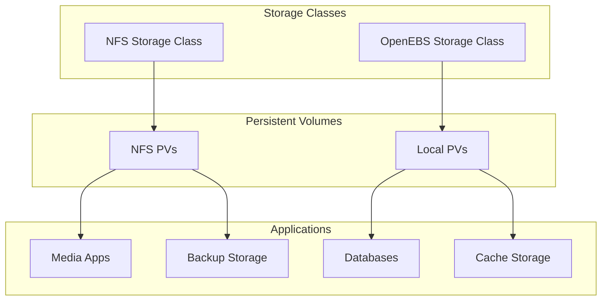

# Storage Architecture

## Storage Overview



## Storage Classes

### NFS Storage Class
- Used for shared storage across nodes
- Ideal for media storage and shared configurations
- Supports ReadWriteMany (RWX) access mode
- Configuration:
```yaml
apiVersion: storage.k8s.io/v1
kind: StorageClass
metadata:
  name: nfs-csi
provisioner: nfs.csi.k8s.io
parameters:
  server: nfs-server
  share: /export/nfs
```

### OpenEBS Storage Class
- Local storage for performance-critical applications
- Used for databases and caching layers
- Supports ReadWriteOnce (RWO) access mode
- Configuration:
```yaml
apiVersion: storage.k8s.io/v1
kind: StorageClass
metadata:
  name: openebs-local
provisioner: openebs.io/local
volumeBindingMode: WaitForFirstConsumer
```

## Storage Considerations

### Performance
- Use OpenEBS local storage for:
  - Databases requiring low latency
  - Cache storage
  - Write-intensive workloads
- Use NFS storage for:
  - Media files
  - Shared configurations
  - Backup storage
  - Read-intensive workloads

### Backup Strategy


### Volume Snapshots
- Regular snapshots for data protection
- Snapshot schedules based on data criticality
- Retention policies for space management

## Best Practices

1. **Storage Class Selection**
   - Use appropriate storage class based on workload requirements
   - Consider access modes needed by applications
   - Account for performance requirements

2. **Resource Management**
   - Set appropriate storage quotas
   - Monitor storage usage
   - Plan for capacity expansion

3. **Data Protection**
   - Regular backups
   - Snapshot scheduling
   - Replication where needed

4. **Performance Optimization**
   - Use local storage for performance-critical workloads
   - Implement caching strategies
   - Monitor I/O patterns
