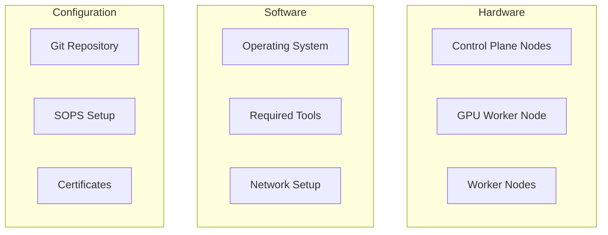
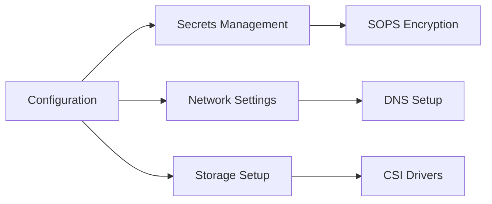
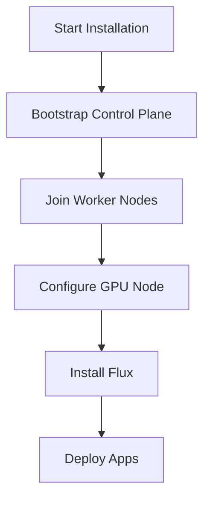

# Installation Guide

## Prerequisites



## Hardware Requirements

### Control Plane Nodes (3x)
- CPU: 4 cores per node
- RAM: 16GB per node
- Role: Cluster control plane

### GPU Worker Node (1x)
- CPU: 16 cores
- RAM: 128GB
- GPU: 4x NVIDIA Tesla P100
- Role: GPU-accelerated workloads

### Worker Nodes (2x)
- CPU: 16 cores per node
- RAM: 128GB per node
- Role: General workloads

## Software Prerequisites
1. Operating System
   - Linux distribution
   - Updated system packages
   - Required kernel modules
   - NVIDIA drivers (for GPU node)

2. Required Tools
   - kubectl
   - flux
   - SOPS
   - age/gpg
   - task

## Initial Setup

### 1. Repository Setup
```bash
# Clone the repository
git clone https://github.com/username/dapper-cluster.git
cd dapper-cluster

# Create configuration
cp config.sample.yaml config.yaml
```

### 2. Configuration



#### Edit Configuration
```yaml
cluster:
  name: dapper-cluster
  domain: example.com

network:
  cidr: 10.0.0.0/16

storage:
  nfs:
    server: nfs.example.com
    path: /export/nfs
```

### 3. Secrets Management
- Generate age key
- Configure SOPS
- Encrypt sensitive files

### 4. Bootstrap Process



#### Bootstrap Commands
```bash
# Initialize flux
task flux:bootstrap

# Verify installation
task cluster:verify

# Verify GPU support
kubectl get nodes -o wide
nvidia-smi # on GPU node
```

## Post-Installation

### 1. Verify Components
- Check control plane health
- Verify worker node status
- Test GPU functionality
- Check storage provisioners
- Verify network connectivity

### 2. Deploy Applications
- Deploy core services
- Configure monitoring
- Setup backup systems
- Deploy GPU-enabled workloads

### 3. Security Setup
- Configure network policies
- Setup certificate management
- Enable monitoring and alerts
- Secure GPU access

## Troubleshooting

Common installation issues and solutions:

1. **Control Plane Issues**
   - Verify etcd cluster health
   - Check control plane components
   - Review system logs

2. **Worker Node Issues**
   - Verify node join process
   - Check kubelet status
   - Review node logs

3. **GPU Node Issues**
   - Verify NVIDIA driver installation
   - Check NVIDIA container runtime
   - Validate GPU visibility in cluster

4. **Storage Issues**
   - Verify NFS connectivity
   - Check storage class configuration
   - Review PV/PVC status

5. **Network Problems**
   - Check DNS resolution
   - Verify network policies
   - Review ingress configuration

## Maintenance

### Regular Tasks
1. System updates
2. Certificate renewal
3. Backup verification
4. Security audits
5. GPU driver updates

### Health Checks
- Component status
- Resource usage
- Storage capacity
- Network connectivity
- GPU health

## Next Steps

After successful installation:
1. Review [Architecture Overview](../architecture/overview.md)
2. Configure [Storage](../architecture/storage.md)
3. Setup [Network](../architecture/network.md)
4. Deploy [Applications](../apps/media.md)
