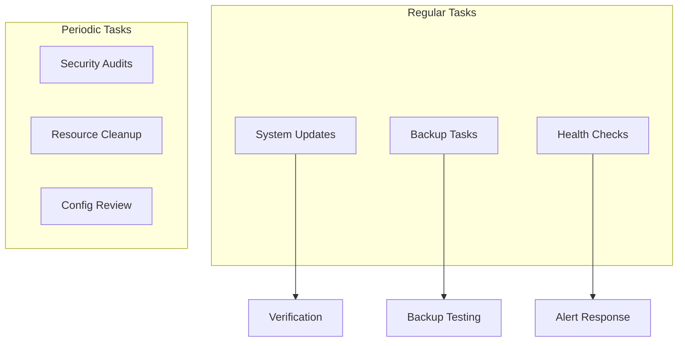
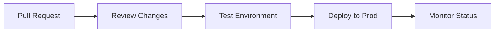
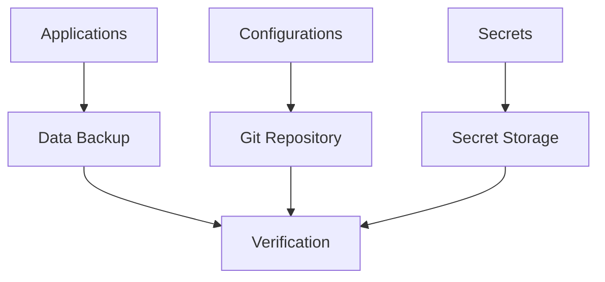
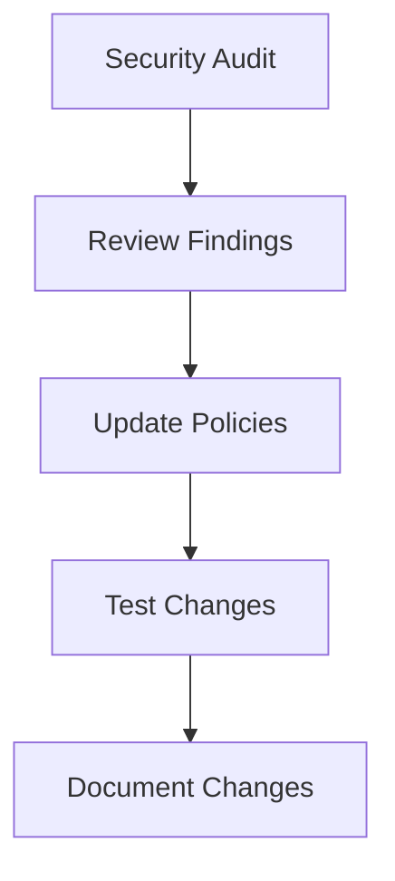

# Maintenance Guide

## Maintenance Overview



## Regular Maintenance

### Daily Tasks
1. Monitor system health
   - Check cluster status
   - Review resource usage
   - Verify backup completion
   - Check alert status

### Weekly Tasks
1. Review system logs
2. Check storage usage
3. Verify backup integrity
4. Update documentation

### Monthly Tasks
1. Security updates
2. Certificate rotation
3. Resource optimization
4. Performance review

## Update Procedures

### Flux Updates



### Application Updates
1. Review release notes
2. Test in staging if available
3. Update flux manifests
4. Monitor deployment
5. Verify functionality

## Backup Management

### Backup Strategy


### Backup Verification
- Regular restore testing
- Data integrity checks
- Recovery time objectives
- Backup retention policy

## Resource Management

### Cleanup Procedures
1. Remove unused resources
   - Orphaned PVCs
   - Completed jobs
   - Old backups
   - Unused configs

2. Storage optimization
   - Compress old logs
   - Archive unused data
   - Clean container cache

## Monitoring and Alerts

### Key Metrics
- Node health
- Pod status
- Resource usage
- Storage capacity
- Network performance

### Alert Response
1. Acknowledge alert
2. Assess impact
3. Investigate root cause
4. Apply fix
5. Document resolution

## Security Maintenance

### Regular Tasks


### Security Checklist
- [ ] Review network policies
- [ ] Check certificate expiration
- [ ] Audit access controls
- [ ] Review secret rotation
- [ ] Scan for vulnerabilities

## Troubleshooting Guide

### Common Issues

1. **Node Problems**
   - Check node status
   - Review system logs
   - Verify resource usage
   - Check connectivity

2. **Storage Issues**
   - Verify mount points
   - Check permissions
   - Monitor capacity
   - Review I/O performance

3. **Network Problems**
   - Check DNS resolution
   - Verify network policies
   - Review ingress status
   - Test connectivity

### Recovery Procedures

1. Node Recovery
```bash
# Check node status
kubectl get nodes

# Drain node for maintenance
kubectl drain node-name

# Perform maintenance
# ...

# Uncordon node
kubectl uncordon node-name
```

2. Storage Recovery
```bash
# Check PV status
kubectl get pv

# Check PVC status
kubectl get pvc

# Verify storage class
kubectl get sc
```

## Documentation

### Maintenance Logs
- Keep detailed records
- Document changes
- Track issues
- Update procedures

### Review Process
1. Regular documentation review
2. Update procedures
3. Verify accuracy
4. Add new sections

## Best Practices

1. **Change Management**
   - Use git workflow
   - Test changes
   - Document updates
   - Monitor results

2. **Resource Management**
   - Regular cleanup
   - Optimize usage
   - Monitor trends
   - Plan capacity

3. **Security**
   - Regular audits
   - Update policies
   - Monitor access
   - Review logs
