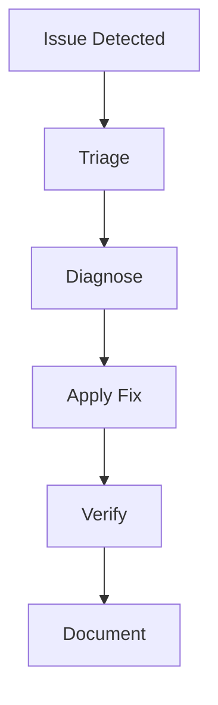
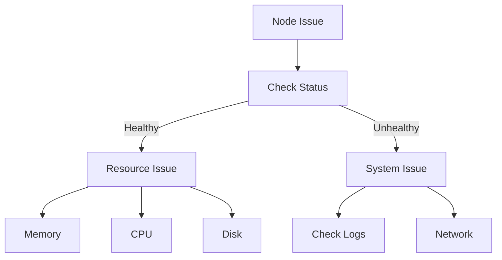
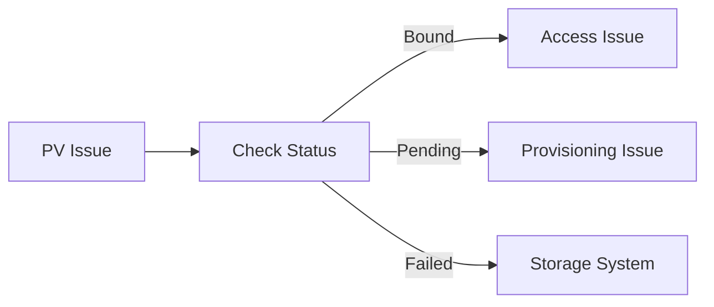
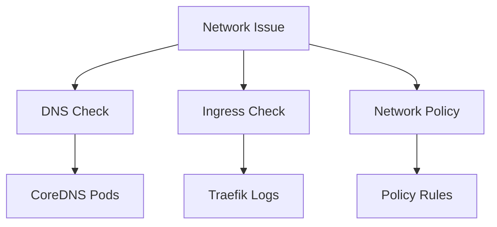
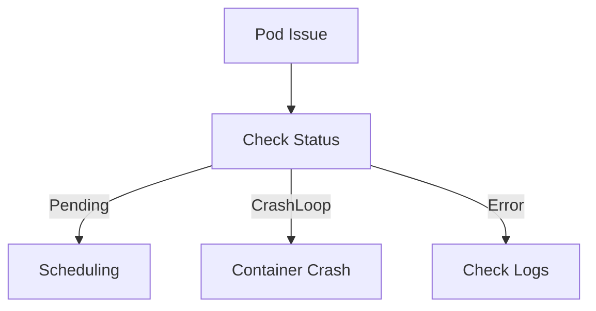
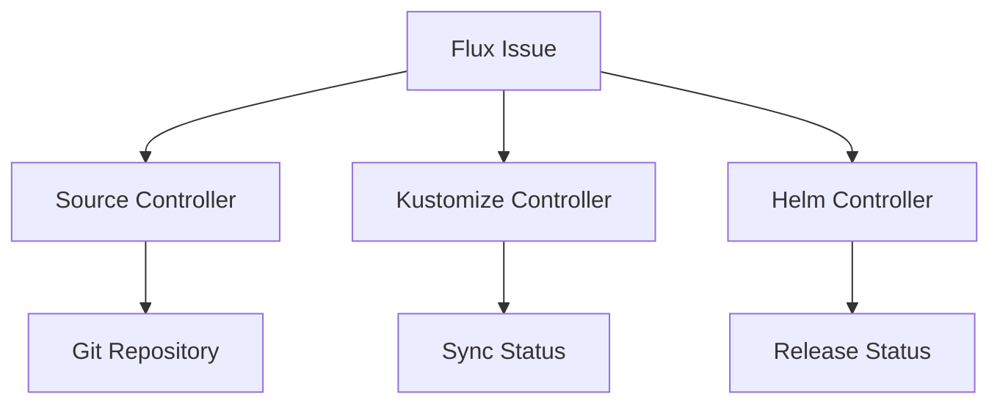
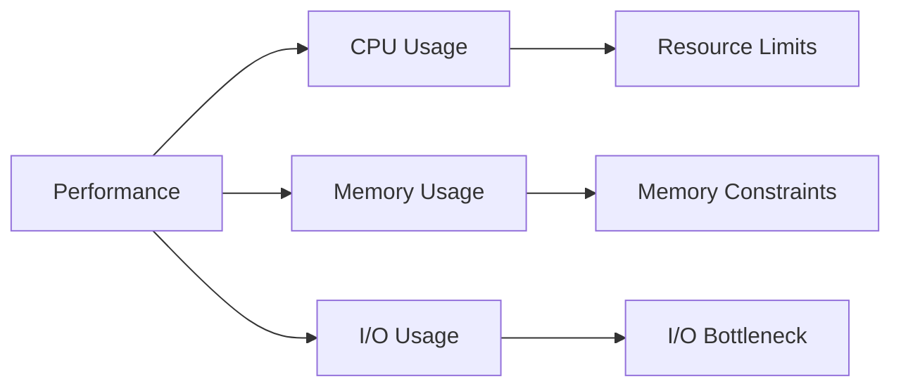

# Troubleshooting Guide

## Diagnostic Workflow



## Common Issues

### 1. Cluster Health Issues

#### Node Problems


**Diagnosis Steps:**
```bash
# Check node status
kubectl get nodes
kubectl describe node <node-name>

# Check system resources
kubectl top nodes
kubectl top pods --all-namespaces

# Check system logs
kubectl logs -n kube-system <pod-name>
```

### 2. Storage Issues

#### Volume Problems


**Resolution Steps:**
```bash
# Check PV/PVC status
kubectl get pv,pvc --all-namespaces

# Check storage class
kubectl get sc

# Check provisioner pods
kubectl get pods -n storage
```

### 3. Network Issues

#### Connectivity Problems


**Diagnostic Commands:**
```bash
# Check DNS
kubectl get pods -n kube-system -l k8s-app=kube-dns
kubectl logs -n kube-system -l k8s-app=kube-dns

# Check ingress
kubectl get ingress --all-namespaces
kubectl describe ingress <ingress-name> -n <namespace>
```

### 4. Application Issues

#### Pod Problems


**Troubleshooting Steps:**
```bash
# Check pod status
kubectl get pods -n <namespace>
kubectl describe pod <pod-name> -n <namespace>

# Check logs
kubectl logs <pod-name> -n <namespace>
kubectl logs <pod-name> -n <namespace> --previous
```

## Flux Issues

### GitOps Troubleshooting


**Resolution Steps:**
```bash
# Check Flux components
flux check

# Check sources
flux get sources git
flux get sources helm

# Check reconciliation
flux get kustomizations
flux get helmreleases
```

## Performance Issues

### Resource Constraints


**Analysis Commands:**
```bash
# Check resource usage
kubectl top pods -n <namespace>
kubectl top nodes

# Check resource quotas
kubectl get resourcequota -n <namespace>
```

## Recovery Procedures

### 1. Node Recovery
1. Drain node
2. Perform maintenance
3. Uncordon node
4. Verify workloads

### 2. Storage Recovery
1. Backup data
2. Fix storage issues
3. Restore data
4. Verify access

### 3. Network Recovery
1. Check connectivity
2. Verify DNS
3. Test ingress
4. Update policies

## Best Practices

### 1. Logging
- Maintain detailed logs
- Set appropriate retention
- Use structured logging
- Enable audit logging

### 2. Monitoring
- Set up alerts
- Monitor resources
- Track metrics
- Use dashboards

### 3. Documentation
- Document issues
- Record solutions
- Update procedures
- Share knowledge

## Emergency Procedures

### Critical Issues
1. Assess impact
2. Implement temporary fix
3. Plan permanent solution
4. Update documentation

### Contact Information
- Maintain escalation paths
- Keep contact list updated
- Document response times
- Track incidents
