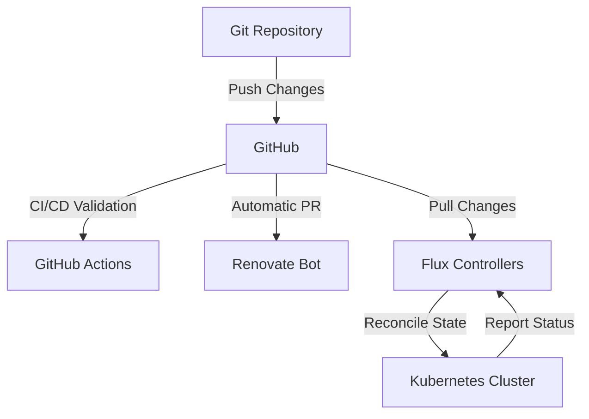
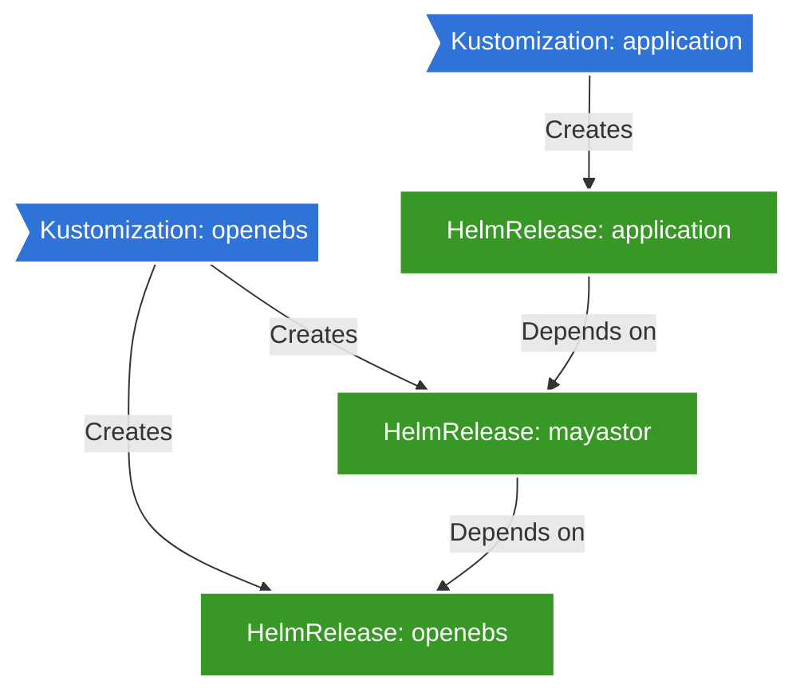

# System Patterns

This document outlines the key architectural patterns, design decisions, and system organization principles used in the Dapper Cluster project.

## Architecture Overview

The Dapper Cluster architecture follows a GitOps-driven, declarative infrastructure model with Kubernetes at its core. The system utilizes a virtualized infrastructure running on Proxmox, with Talos Linux as the operating system for Kubernetes nodes.

### Key Architectural Patterns

#### GitOps Workflow

The entire infrastructure is defined as code in this Git repository, with Flux ensuring that the cluster state always matches the desired state defined in Git.



#### Flux Dependency Management

Applications are deployed through a chain of dependencies, managed by Flux kustomizations and HelmReleases:



#### Layered Security Model

Security is implemented in multiple layers:

1. **Network Perimeter**: OPNsense router with strict firewall rules
2. **Network Segmentation**: VLANs separating different types of devices
3. **Kubernetes Security**: Talos Linux as a hardened, minimal OS
4. **Workload Security**: Least privilege principles, network policies
5. **Secret Management**: Encrypted with SOPS, managed by External Secrets
6. **Authentication**: Centralized via Authentik
7. **Policy Enforcement**: Kyverno policies for governance and compliance

#### Storage Architecture

The storage architecture is hybrid:

1. **High-Performance Block Storage**: OpenEBS Mayastor for database and stateful workloads
2. **Network Attached Storage**: Separate ZFS-based NAS for bulk storage, media, and backups
3. **Backup Strategy**: VolSync for PVC backups, external solutions for critical data

#### Observability Stack

A comprehensive monitoring stack is implemented:

1. **Metrics**: Prometheus (via kube-prometheus-stack)
2. **Visualization**: Grafana dashboards
3. **Alerting**: Alertmanager with Pushover notifications
4. **Logging**: Loki and Promtail
5. **Synthetic Monitoring**: Blackbox Exporter and Gatus
6. **Status Page**: Public status indicators

## Component Relationships

### Kubernetes Namespace Organization

Applications are organized into functional namespaces that group related services:

- **kube-system**: Core Kubernetes components
- **flux-system**: Flux controllers and configurations
- **cert-manager**: Certificate management
- **observability**: Monitoring and logging tools
- **security**: Authentication and security services
- **home-automation**: Home Assistant and related services
- **media**: Media services (Plex, Sonarr, etc.)
- **database**: Database services
- **storage**: Storage-related services
- **network**: Networking services
- **selfhosted**: Personal productivity applications

### Application Deployment Pattern

Most applications follow a consistent deployment pattern:

1. **Kustomization** (`ks.yaml`): Defines the namespace and references the app deployment
2. **App Kustomization** (`app/kustomization.yaml`): References the HelmRelease and any related resources
3. **HelmRelease** (`app/helmrelease.yaml`): Defines the Helm chart, values, and dependencies

Example structure:
```
kubernetes/apps/[category]/[application]/
├── ks.yaml                  # Top-level kustomization
└── app/
    ├── kustomization.yaml   # App-level kustomization
    ├── helmrelease.yaml     # Helm release definition
    └── [other resources]    # ConfigMaps, Secrets, etc.
```

### Inter-Service Communication

Services communicate primarily through:

1. **Kubernetes Services**: Internal DNS-based discovery
2. **Ingress Resources**: For HTTP/HTTPS traffic routing
3. **Network Policies**: Controlling which services can communicate
4. **Service Meshes**: For advanced routing and security (when implemented)

## Design Patterns and Principles

1. **Infrastructure as Code**: All infrastructure defined declaratively in Git
2. **Immutable Infrastructure**: Talos nodes are not modified in-place but replaced
3. **Least Privilege**: Services run with minimal required permissions
4. **Defense in Depth**: Multiple layers of security controls
5. **Automated Reconciliation**: Flux ensures desired state is maintained
6. **Dependency Management**: Explicit dependencies between components
7. **Monitoring by Default**: All services include monitoring and alerting

This document will evolve as the system architecture and patterns are refined.
